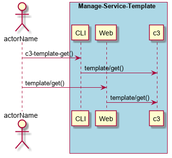

.. _Scenario-Get-Service-Template:

Get Service Template
====================
Get Service Template using CLI and Web Interface with ... <parameters>

** CLI **
.. code-block:: none

  # c3 template get <parameters>
  # c3 template get exmaple

** Web **

.. image:: Get-Service-TemplateWeb.png

** REST **

template/get

============  ========  ===================
Name          Value     Description
------------  --------  -------------------
parameter1    value1    Description1
============  ========  ===================
