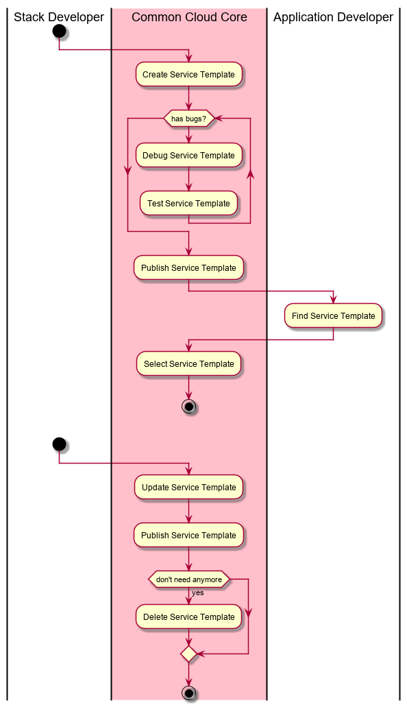

.. _UseCase-Manage-Service-Template:

Manage Service Template
=======================

The :ref:`Actor-Stack-Developer` is the primary Actor that manages Service Templates.
The Service Templates are used by :ref:`Actor-Application-Developer` to develop
applications and services for deployment.

Actors
------

* :ref:`Actor-Application-Developer`
* :ref:`Actor-Stack-Developer`

Activities
----------

Detail Scenarios
----------------

.. toctree::
    :maxdepth: 1
    :glob:

    Scenario*

Systems Involved
----------------

* :ref:`SubSystem-Application-Manager`
* :ref:`SubSystem-Operations-Manager`
* :ref:`SubSystem-Artifact-Repository`

