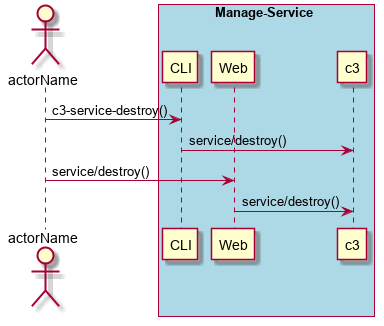

.. _Scenario-Destroy-Service:

Destroy Service
====================
Destroy Service using CLI and Web Interface with ... <parameters>

** CLI **
.. code-block:: none

  # c3 service destroy <parameters>
  # c3 service destroy exmaple

** Web **

** REST **

service/destroy

============  ========  ===================
Name          Value     Description
------------  --------  -------------------
parameter1    value1    Description1
============  ========  ===================
