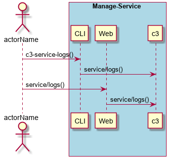

.. _Scenario-Get-Service-Logs:

Get Service Logs
================

Get Service Logs using CLI and Web Interface with ... <parameters>

** CLI **
.. code-block:: none

  # c3 service logs <parameters>
  # c3 service logs exmaple

** Web **

.. image:: Get-Service-LogsWeb.png

** REST **

service/logs

============  ========  ===================
Name          Value     Description
------------  --------  -------------------
parameter1    value1    Description1
============  ========  ===================
