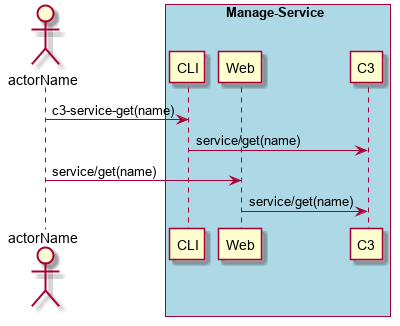

.. _Scenario-Get-Service:

Get Service
===========
Get Service using CLI and Web Interface with the name of the service. It will return a json representation of the service.

** CLI **
.. code-block:: none

  # c3 service get --name <string>
  # c3 service get --name myService

** Web **

.. image:: Get-ServiceWeb.png

** REST **

service/get

============  ========  ===================
Name          Value     Description
------------  --------  -------------------
name          string    Name of the service
============  ========  ===================
