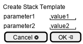

.. _Scenario-Create-Stack-Template:

Create Stack Template
=====================

Create Stack Template using CLI and Web Interface with ... <parameters>

.. image:: Create-Stack-Template.png

**CLI**

This is an example of a command line interface for the user to interact with the system.

.. code-block:: none

  # c3 template create <parameters>
  # c3 template create exmaple

**Web Interface(Mock-up)**

Mock up web interface for the scenario.

**REST**

This is an example of the RESTful interface for the scenario.

*template/create*

============  ========  ===================
Name          Value     Description
------------  --------  -------------------
parameter1    value1    Description1
============  ========  ===================
