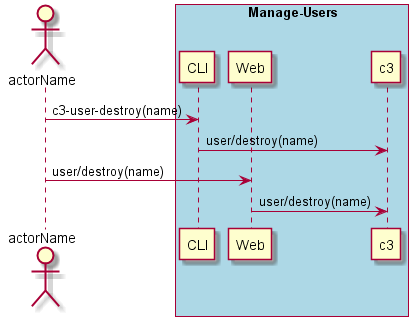
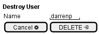

.. _Scenario-Destroy-User:

Destroy User
============

Destroy User using CLI and Web Interface with ... <parameters>

** CLI **
.. code-block:: none

  # c3 user destroy <parameters>
  # c3 user destroy exmaple

** Web **

** REST **

user/destroy

============  ========  ===================
Name          Value     Description
------------  --------  -------------------
parameter1    value1    Description1
============  ========  ===================
