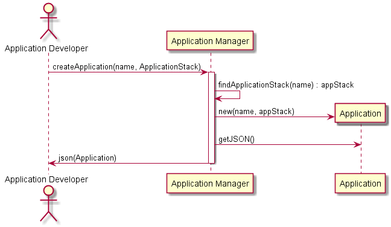

.. _Scenario-Create-Application:

Scenario Create Application
===========================

Application Develop interacts with the Application manager to create an Application.
A json or yaml representation of the application is downloaded to the working directory
of the project for the application.

**User**

* :ref:`Actor-Application-Developer`

::Systems**

* :ref:`Subsystem-Application-Manager`
