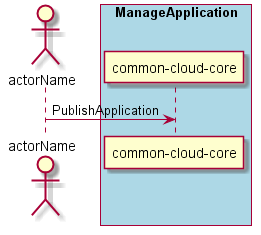

.. _Scenario-Publish-Application:

Scenario Publish Application
============================
An :ref:`Actor-Application-Developer` publishes the application
to the Artifact Repository. This allows others to use the application. For production runs
or to clone and mirror for their own new application.

**Users**
* :ref:`Actor-Application-Developer`

**Systems**

* :ref:`SubSystem-Artifact-Repository`
