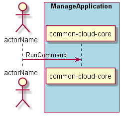

.. Scenario-Run-Command:

Scenario Run Command
====================

:ref:`Actor-Application-Developer` interacts with the Application manager to run commands on the same
machine as the services or application are running in a specified environment.

**Users**

* :ref:`Actor-Application-Developer`

**Systems**

* :ref:`SubSystem-Application-Manager`

