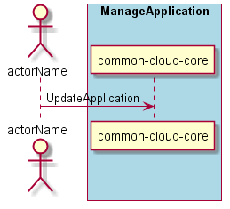

.. _Scenario-Update-Application:

Scenario Update Application
===========================

When :ref:`Actor-Application-Developer` are working they need to update the application with new source code.
This could include any or all of the services in the application. The developer should be able
to update all of the services, one service and any number of services. The source code at the
top level project directory will be pushed out to the all of the services specified. If the service
does not have source code corresponding then it is checked for the latest updates.

**Users**

* :ref:`Actor-Application-Developer`

**Systems**

* :ref:`SubSystem-Application-Manager`
