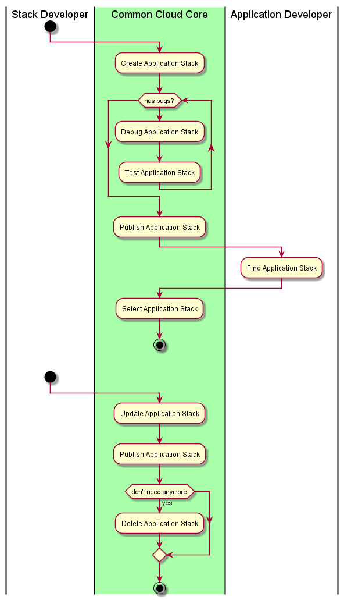

.. _UseCase-Manage-Application-Stack:

Use Case Manage Application Stack
=================================

:ref:`Actor-StackDeveloper` create, publish, debug different stacks so they share them with developers.

Actors
------

* :ref:`Actor-StackDeveloper`
* :ref:`Actor-ApplicationDeveloper`

Activities
----------

Detail Scenarios
----------------

.. toctree::
    :maxdepth: 2
    :glob:
    :caption: Detail Scenarios

    Scenario*

Systems Involved
----------------

* :ref:`SubSystem-Application-Manager`
* :ref:`SubSystem-ArtifactRepository`
* :ref:`SubSystem-EnvironmentManager`
