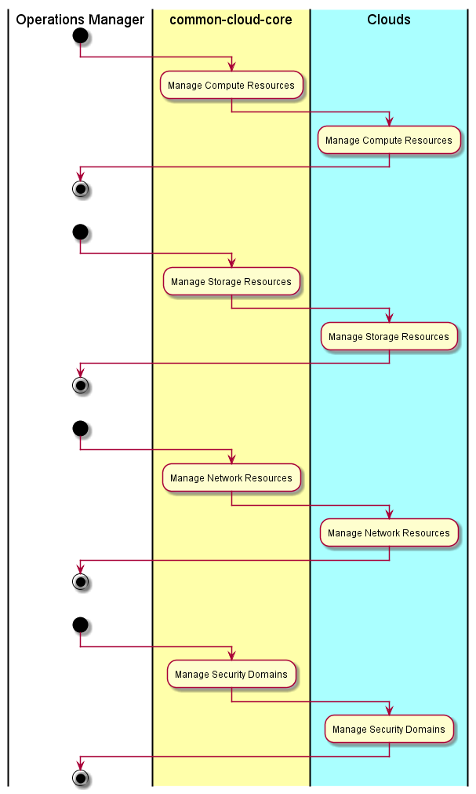

.. _UseCase-Manage-Infrastructure:

Use Case Manage Infrastructure
==============================

:ref:`Actor-OperationsManager` manages infrastructure in the Private and Public Clouds.
The C3 architecture should be a passthru to the SDI layers in the Private and Public Clouds.

Actors
------

* :ref:`Actor-OperationsManager`

Activities
----------

* Manage Compute Resources
* Manage Storage Resources
* Manage Network Resources
* Manage Security Domains

Detail Scenarios
----------------

.. toctree::
    :maxdepth: 2
    :glob:
    :caption: Detail Scenarios

    Scenario*

Systems Involved
----------------

* :ref:`SubSystem-SDI-Cloud`

