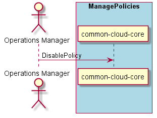

.. _Scenario-Disable-Policy:

Scenario Disable Policy
=======================

The :ref:`Actor-Operations-Manager` disables policies in the hybrid cloud. The policies
are still available in the system but they do not effect the cloud, resources, services and users.
The policy can be "enabled" again using :ref:`Scenario-Enable-Policy`.

**Users**

* :ref:`Actor-Operations-Manager`

**Systems**

* :ref:`SubSystem-Operations-Manager`
