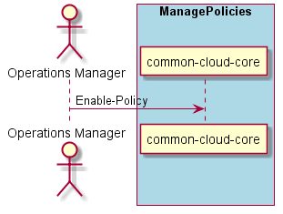

.. _Scenario-Enable-Policy:

Scenario Enable Policy
======================

The :ref:`Actor-OperationsManager` enables policies before they effect the clouds,
resources, services and users. Policies can be "disabled" using the :ref:`Scenario-Disable-Policy` command.

**Users**

* :ref:`Actor-OperationsManager`

**Systems**

* :ref:`SubSystem-Operatons-Manager`

