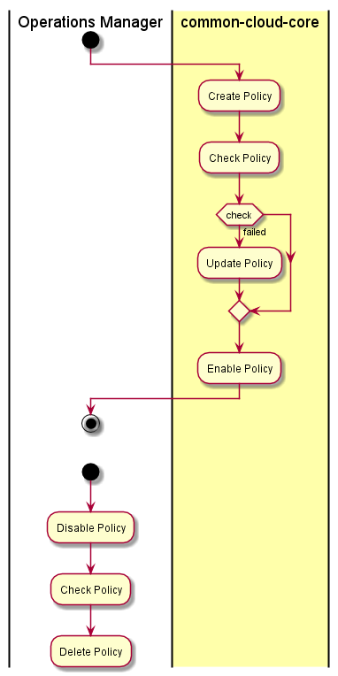

.. _UseCase-Manage-Policies:

UseCase-Manage-Policies
=======================

The :ref:`Actor-OperationsManager` manages the policies of the Hybrid Cloud.
Policies can be applied to different clouds based on the user, project, and/or group.
These policies are applied to work requests, resources and clouds.

Actors
------

* :ref:`Actor-OperationsManager`

Activities
----------

Detail Scenarios
----------------

.. toctree::
    :maxdepth: 2
    :glob:
    :caption: Detail Scenarios

    Scenario*

Systems Involved
----------------

* TBD

