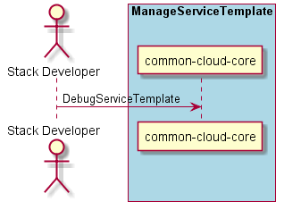

.. _Scenario-Debug-Service-Template:

Scenario Debug Service Template
===============================

:ref:`Actor-StackDeveloper` interacts with the Operations Manager to debug a Service Template.
This should include deploying services into a test cloud and being able to access logs, debug
running applications and connectivity to other services.

**Users**

* :ref:`Actor-Stack-Developer`

**Systems**

* :ref:`SubSystem-OperationsManager`
