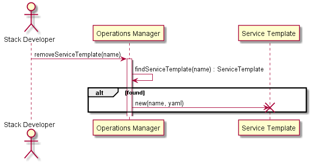

.. _Scenario-Delete-Service-Template:
Scenario Delete Service Template
================================

:ref:`Actor-StackDeveloper` interacts with the Operations Manager to remove a Service Template.

**Users**

* :ref:`Actor-Stack-Developer`

**Systems**

* :ref:`SubSystem-Operations-Manager`
