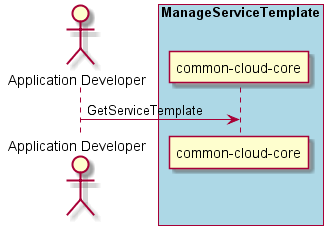

.. _Scenario-Get-Service-Template:

Scenario Get Service Template
=============================

:ref:`Actor-ApplicationDeveloper` interacts with the Application Manager
to find the service template to use.

**Users**

* :ref:`Actor-ApplicationDeveloper`

**Systems**

* :ref:`SubSystem-ApplicationManager`
